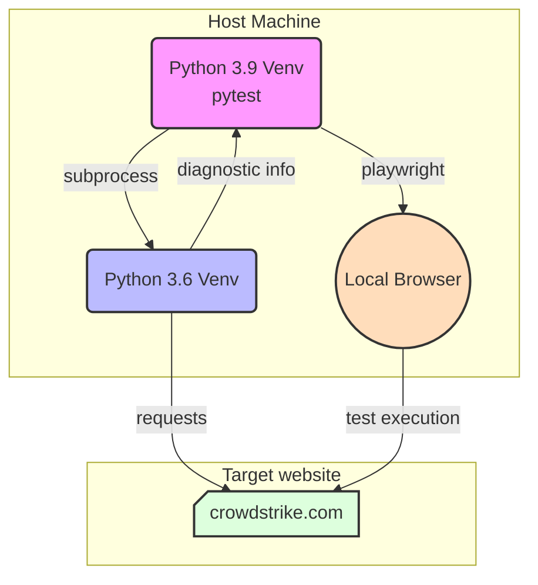
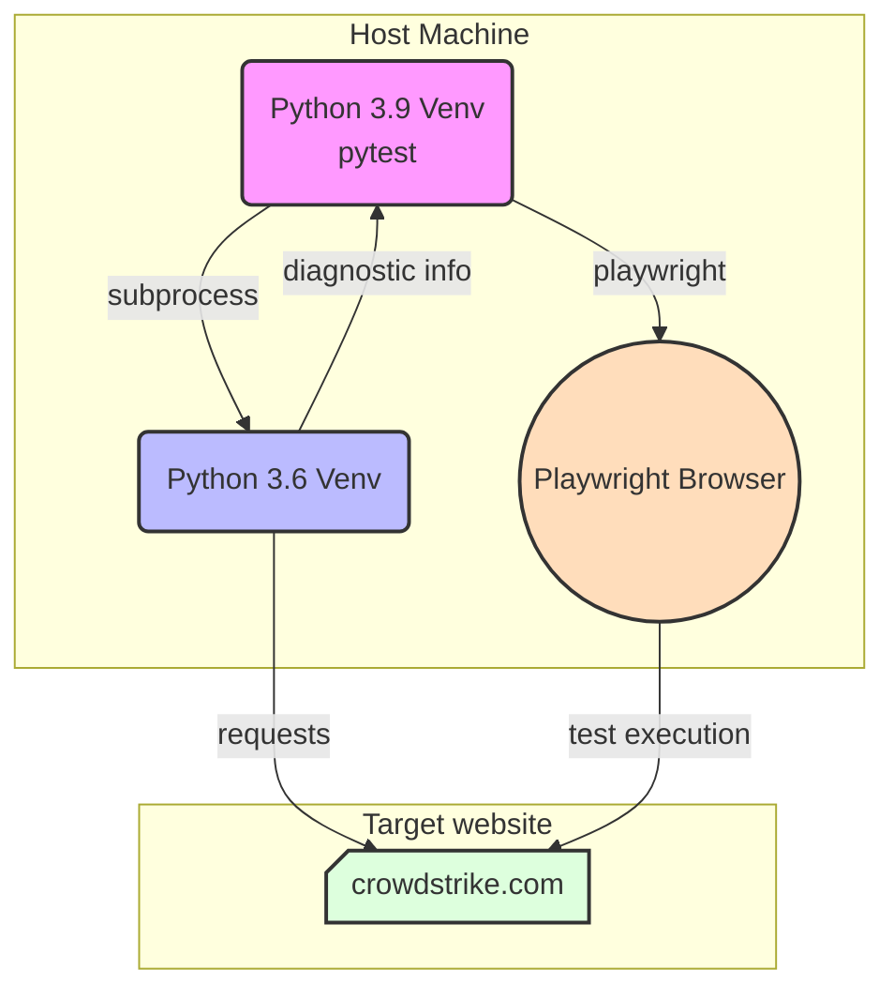

# Python 3.6 with Playwright Tests

This project demonstrates running Playwright tests (requiring Python 3.9) alongside Python 3.6 tests using subprocess in a containerized environment.

## Test Execution Flow

### Local Test Execution


### Remote Test Execution


## Requirements

- pyenv for managing Python versions
- Docker and Docker Compose
- make

## Setup

1. Install required Python versions using pyenv:
```bash
pyenv install 3.6.15
pyenv install 3.9.21
```

2. Make both Python versions available:
```bash
# Add both versions to your global Python versions
pyenv global $(pyenv global) 3.6.15 3.9.21

# Verify installations
which python3.6
which python3.9
```

3. Set up the project:
```bash
make setup
```

This will:
- Create Python virtual environments for both Python 3.6 and 3.9
- Install dependencies for both environments
- Install Playwright and its browser dependencies
- Create the test results directory

## Running Tests

### Local Testing
To run tests using a local browser:
```bash
make test-local
```

### Remote Testing with Docker
To run tests using the containerized Playwright server:

1. Start the Playwright container:
```bash
make playwright-up
```

2. Run the tests:
```bash
make test-remote
```

3. Stop the Playwright container when done:
```bash
make playwright-down
```

### Debug Testing
To run tests in headed mode with slow motion for debugging:
```bash
make test-debug
```

### Filtering Tests
You can run specific tests using the TEST_FILTER parameter:
```bash
make test-local TEST_FILTER="test_basic_navigation"
make test-remote TEST_FILTER="test_basic_navigation"
```

## Test Artifacts

Test results and artifacts are stored in the `test-results` directory:
- JUnit XML report: `test-results/junit.xml`
- HTML report: `test-results/report.html`
- Screenshots (on failure)
- Videos (on failure)

## Project Structure

- `tests/` - Test files
- `requirements.txt` - Python 3.6 dependencies
- `requirements-playwright.txt` - Python 3.9 dependencies for Playwright
- `docker-compose.yml` - Docker services configuration
- `Makefile` - Build and test automation
- `pytest.ini` - Pytest configuration

## Cleaning Up

To remove virtual environments and clean temporary files:
```bash
make clean
```

## Available Make Commands

- `make setup` - Create virtual environments and install dependencies
- `make clean` - Remove virtual environments and cache files
- `make test-local` - Run tests with local browser
- `make test-remote` - Run tests against Playwright container
- `make test-debug` - Run tests with debugging options
- `make install-deps` - Install dependencies in both virtual environments
- `make playwright-up` - Start Playwright container
- `make playwright-down` - Stop Playwright container